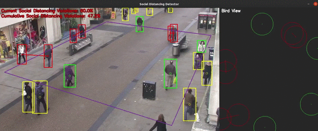

# Social Distancing Detector

## Table of Contents

* [About the Project](#about-the-project)
  * [Built With](#built-with)
* [Getting Started](#getting-started)
  * [Installation](#installation)
* [Usage](#usage)
* [Authors](#authors)
* [Acknowledgments](#acknowledgments)


## About The Project




In ```Social Distancing Detector``` we present a tool to monitor people's compliance to social distancing in crowded places in real-time. Our approach is based on YOLOv3 neural network to detect pedestrian in a video stream and on homography to get the bird view of a user-selected ROI. From people's position in the bird view we measure the pairwise distance and then we show the results.

For more information, read the [report](report.pdf) located in the repo
root.

### Built With

* [Python](https://www.python.org/)
* [YOLOv3](https://pjreddie.com/darknet/yolo/)
* [OpenCV](https://opencv.org/)


## Getting Started

To get a local copy up and running follow these simple steps.

### Installation
 
1. Clone the repo
```sh
git clone https://github.com/LorenzoAgnolucci/SocialDistancingDetector.git
```
2. Download the network weights from the link in ```yolo-coco/yolov3_weights.txt``` and copy them in the ```yolo-coco``` folder

3. If you want to run the code on a GPU (strongly recommended but not necessary), follow [this tutorial](https://www.pyimagesearch.com/2020/02/03/how-to-use-opencvs-dnn-module-with-nvidia-gpus-cuda-and-cudnn/) to compile OpenCV accordingly

4. The project provides a ```requirements.txt``` file that can be used to install all the dependencies (except for OpenCV if you compiled it) in order to avoid dependency/reproducibility problems. For example in your virtual environment run 
```sh
pip install -r requirements.txt
```


## Usage

1. If you want to calibrate your camera print a [chessboard](https://miro.medium.com/max/700/1*C5b8iGTkcgmLZccfeklcmw.png), take at least 20 photos from different angles and distances and copy them in a folder. Run ```camera_calibration.py``` modifying the paths and the chessboard parameters as needed

2. If needed change the ```frame_to_skip``` parameter in ```VideoGet.py``` to skip an arbitrary number of frames to reduce the latency

3. Run ```social_distance_detector.py``` and choose the input video stream (optionally adding the calibration matrices path) between the available ones:
   - Computer webcam
   - IP webcam
   - Local video (some examples are in ```/video```)
   - Link to stream (some examples are in ```webcam_stream.txt```)

## Authors

* [**Lorenzo Agnolucci**](https://github.com/LorenzoAgnolucci)
* [**Federico Nocentini**](https://github.com/FedeNoce)


## Acknowledgments
Image and Video Analysis © Course held by Professor [Pietro Pala](https://scholar.google.it/citations?user=l9j1pZEAAAAJ&hl=en) - Computer Engineering Master Degree @[University of Florence](https://www.unifi.it/changelang-eng.html)
